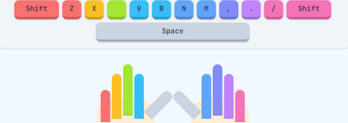

<div align="center">
  
</div>

<br />

# 易打字 (Yidazi) - 在线零基础键盘盲打指法跟练器 ⌨️✨

> **零基础、免下载、即开即练！帮助您或您的孩子快速掌握计算机标准盲打指法。**

**易打字 (Yidazi)** 是一款专为键盘零基础用户、初学者及儿童设计的**在线指法盲打跟练器**。我们结合了游戏化的闯关设计、智能拼音汉字对照和动态虚拟双手引导，让打字练习变得不再枯燥，轻松帮助您建立正确的肌肉记忆，实现快速盲打。

✨ **在线体验**：直接在您的现代浏览器中打开即可开始练习！

---

## 🚀 核心特色亮点

### 🎮 1. 游戏化趣味关卡设计
项目内置了 **10 个循序渐进的跟练关卡**。从最基础的基准键（`A S D F` 与 `J K L ;`）开始，逐步扩展到食指/中指、无名指/小指、大写字母与标点符号，最后挑战综合大测试。
每个关卡通关后，系统会根据您的**错误率**与**正确率**动态结算 **3 星评级**，自动记录您的练习进度！

### 🧠 2. 拼音汉字对照，完美攻克中文打字
不同于市面上仅支持英文练习的传统打字工具，易打字特别针对中文输入进行了系统化优化。
- **关卡内拼音提示**：在拼音跟练关卡中，系统会在汉字上方实时标示对应的拼音音节，手把手教您如何用英文键盘拼写出正确汉字。
- **智能音节拆解**：基于强大的 `pinyin-pro` 处理库，将汉字拼音准确映射到每一个键位上。

### 🪁 3. 经典古诗词与自由练习模式
除了标准关卡，我们还贴心地加入了**自由练习（诗词跟练）模式**：
- **内置唐诗宋词**：精选《静夜思》、《春晓》、《登鹳雀楼》等脍炙人口的经典诗词，在练习指法的同时领略国学之美。
- **一键随机挑选**：随机为你匹配练习文本，保持新鲜感。
- **自定义文章支持**：完美支持长短文练习，动态生成拼音对照。

<div align="center">
  
</div>

### 👐 4. 科学指法与虚拟双手动态引导
打字时总是忍不住看键盘？易打字拥有强大的**实时视觉指引系统**：
- **虚拟键盘高亮**：动态在屏幕上高亮当前需要按下的键位。
- **虚拟双手动态投影**：屏幕上有一双半透明的双手，会根据当前按键实时闪烁对应的小手指，指示正确的指法按键区域。

<div align="center">
  
</div>

### ⚠️ 5. 输入法状态智能检测提醒
在使用网页打字练习时，中文输入法（IME）常常会干扰练习流程。易打字内置了**输入法智能分析**，当检测到用户开启了中文输入法时，会在屏幕上弹出温馨且显眼的提示：
> *"请切换到【英文输入法】！(关闭中文输入)"*

帮助用户保持在最流畅的盲打盲练状态。

---

## 🛠️ 本地运行与开发指南

如果您希望在本地运行或部署 **易打字**，只需按照以下极简步骤操作：

### 前提条件
- 您的系统需安装 **Node.js** (推荐 v18+)

### 步骤说明

1. **获取代码**
   ```bash
   git clone https://github.com/weklyy/KidsType.git yidazi
   cd yidazi
   ```

2. **安装项目依赖**
   ```bash
   npm install
   ```

3. **配置环境变量 (可选，若需体验 AI 进阶功能)**
   复制根目录下的 `.env.example` 并重命名为 `.env.local`：
   ```bash
   cp .env.example .env.local
   ```
   并在其中填写您的 `GEMINI_API_KEY` 以启用云端智能辅导功能。

4. **启动本地开发服务器**
   ```bash
   npm run dev
   ```
   启动成功后，在浏览器中访问 `http://localhost:3000` 即可开始本地跟练！

5. **项目打包构建**
   ```bash
   npm run build
   ```
   静态页面资源将生成在 `./dist` 目录中，可直接部署在任意静态托管服务器（如 Cloudflare Pages、Vercel 等）。

---

## 💻 现代技术栈

易打字采用业界前沿的现代前端架构进行构建，确保响应极速、画面灵动：

- **核心框架**：React 19 & TypeScript 5 (强类型支持，代码坚固)
- **工程打包工具**：Vite 6 (极速热重载，秒级构建)
- **样式系统**：TailwindCSS v4 & Vanilla CSS (流畅的响应式布局，精致的色彩搭配)
- **动效库**：Motion (实现关卡过渡、按钮按压和虚拟按键的丝滑微动效)
- **拼音解析**：`pinyin-pro` (精准且高性能的中文汉字拼音转换器)
- **图标库**：Lucide React (精美的极简矢量图标集)

---

## 🔒 隐私与安全性声明

易打字 (Yidazi) 极其尊重您的个人隐私：
- 您的打字速度、错误次数、闯关星星评级等练习进度数据**完全保存在您本地的浏览器中**（通过 `localStorage` 缓存），绝不上传任何服务器。
- 练习过程完全绿色无广告，为您或您的孩子提供专注、清爽的学习环境。

---

## 📝 开源协议

本项目基于 [Apache-2.0 License](LICENSE) 协议开源。欢迎大家提交 Issue 和 Pull Request，一起让键盘盲打跟练变得更加简单有趣！

---
<div align="center">
  <b>用 易打字 (Yidazi)，零基础快速爱上指法练习！🚀</b>
</div>
